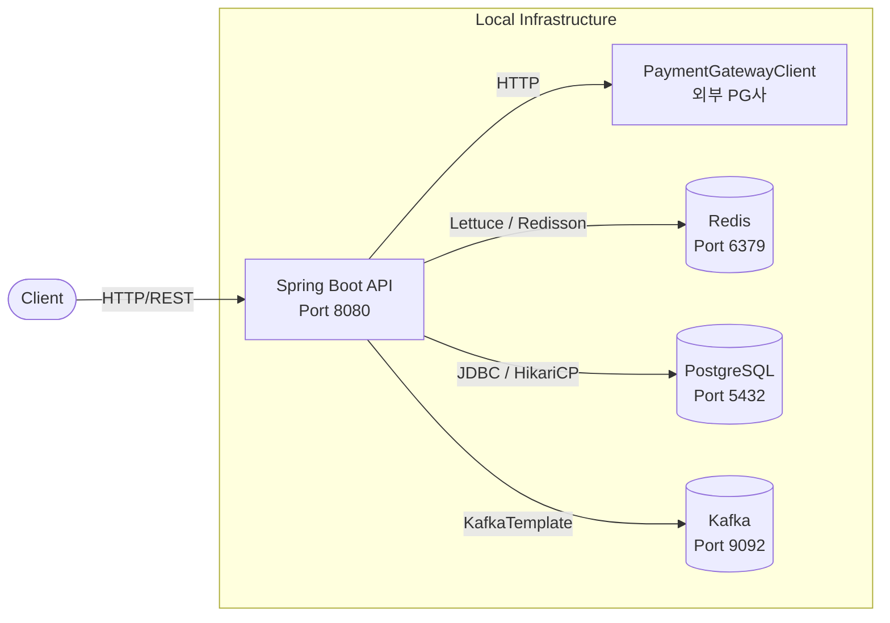
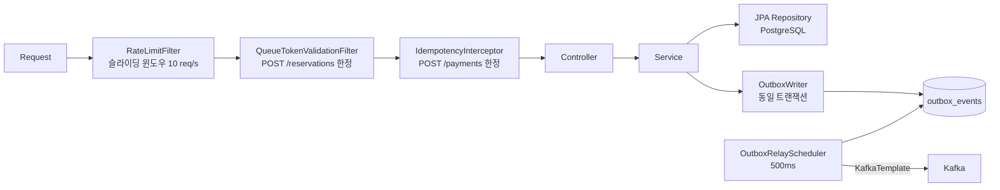

# 시스템 아키텍처

## 인프라 구성



## 요청 처리 파이프라인

모든 요청은 다음 순서로 처리된다:



## 패키지 구조

```
com.api.backend/
├── concert/         # 콘서트·좌석 조회 (@Cacheable)
├── queue/           # 가상 대기열 (Redis ZSet)
├── reservation/     # 좌석 예약 (분산 락 + 상태 머신)
├── payment/         # 결제 처리 (Circuit Breaker)
├── outbox/          # Transactional Outbox → Kafka
├── user/            # 사용자 도메인
└── global/
    ├── config/      # Spring 설정 (Kafka, Redis, Redisson 등)
    ├── filter/      # RateLimitFilter, QueueTokenValidationFilter
    ├── interceptor/ # IdempotencyInterceptor
    ├── lock/        # @DistributedLock AOP (Redisson)
    ├── exception/   # GlobalExceptionHandler
    └── response/    # ApiResponse 공통 응답 래퍼
```

---

## 핵심 설계 결정

### 1. Redis 가상 대기열

DB 기반 대기열은 폴링 부하가 크고, 메시지 큐 기반은 순서 보장이 복잡하다. Redis ZSet을 사용해 입장 순서를 관리하고 별도 서버 없이 구현한다.

```
waiting:{concertId}   ← ZSet, score=입장요청 timestamp
admitted:{userId}:{concertId}  ← String, TTL 10분
```

**토큰 발급 (`POST /api/queue/token`)**
- `ZADD waiting:{concertId} NX score=now userId` — 중복 발급 방지 (NX)
- `ZRANK`로 현재 순위 조회 → 예상 대기 시간 계산

**배치 입장 (`QueueScheduler`, 1초마다)**
- `ZPOPMIN waiting:{concertId} COUNT 50` — 상위 50명 추출
- 추출된 사용자마다 `SET admitted:{userId}:{concertId} 1 PX 600000` (TTL 10분)

**입장 검증 (`QueueTokenValidationFilter`)**
- `POST /api/reservations` 요청 시 `admitted:{userId}:{concertId}` 존재 여부 확인
- 없으면 `403 QueueNotAdmittedException`

**TTL 만료 시 동작**
- 10분 내 예약을 완료하지 않으면 admitted 키가 자동 삭제
- 재입장하려면 대기열 토큰을 다시 발급받아야 함

---

### 2. Double-Lock 좌석 예약

`ReservationService.createReservation` 에서 두 가지 락을 중첩 사용한다.

| 락 | 목적 | 실패 시 |
|----|------|---------|
| Redisson 분산 락 (`seat:lock:{seatId}`, leaseTime 3s) | JVM 노드 간 동시 진입 방지 | `LockAcquisitionFailedException` (HTTP 409) |
| JPA `@Version` Optimistic Lock | 분산 락 만료 후 최후 방어 | `OptimisticLockException` (HTTP 409) |

두 락 모두 의도적으로 유지한다. Redisson 락만 있으면 락 TTL 만료 엣지 케이스에 취약하고, Optimistic Lock만 있으면 분산 환경에서 불필요한 재시도가 폭증한다.

### 2. Transactional Outbox

도메인 이벤트를 Kafka에 직접 발행하면, DB 커밋 성공 후 Kafka 발행이 실패했을 때 이벤트가 유실된다. Outbox 패턴으로 이를 해결한다.

```
Service (단일 트랜잭션)
  ├── domain entity save
  └── outbox_events INSERT (status=PENDING)   ← OutboxWriter (Propagation.MANDATORY)

OutboxRelayScheduler (500ms)
  ├── SELECT PENDING events (최대 50건)
  ├── KafkaTemplate.send(eventType, payload)
  └── UPDATE status = PUBLISHED | incrementRetry | FAILED (retryCount >= 5)
```

`Propagation.MANDATORY`로 서비스 트랜잭션 외부에서 `OutboxWriter.write()`가 호출되는 실수를 컴파일 타임이 아닌 런타임에 즉시 감지한다.

### 3. 결제 멱등성 이중 가드


네트워크 재시도 등으로 동일한 결제 요청이 중복 수신될 수 있다. Redis TTL 캐시(fast path)와 DB unique constraint(cold-start fallback)를 함께 사용한다.

```
POST /api/payments + Idempotency-Key: {key}

IdempotencyInterceptor
  ├── Redis 조회 (idempotency:{key})
  │     ├── 캐시 히트 → 저장된 응답 즉시 반환 (Idempotent-Replayed: true)
  │     └── 캐시 미스 → 컨트롤러 진입
  │
PaymentService
  ├── DB 조회 (findByIdempotencyKey)  ← Redis 재시작 등 cold-start 대비
  ├── PG 호출 및 저장
  └── Redis 저장 (24h TTL)
```

### 4. Redis Lua 스크립트 Rate Limiting

`ZREMRANGEBYSCORE → ZADD → ZCARD → PEXPIRE`를 단일 Lua 스크립트로 원자적으로 실행해 TOCTOU 경쟁 조건을 방지한다.

- 키: `rate:{userId}` (ZSet, TTL 1s)
- 슬라이딩 윈도우 1초, 최대 10 req/user
- 초과 시 HTTP 429

### 5. Resilience4j Circuit Breaker (PG 연동)

| 설정 | 값 |
|------|-----|
| 슬라이딩 윈도우 | 10 calls |
| 실패율 임계치 | 50% |
| Open 대기 시간 | 10s |
| Half-Open 허용 요청 | 3 |
| 타임아웃 | 3s |

Circuit Open 시 `chargeFallback()`이 호출되어 결제 상태가 `PENDING_CONFIRMATION`으로 기록된다. 이후 PG 웹훅을 통해 실제 처리 결과를 수신한다.

---

## 캐싱 전략

| 캐시 키 | TTL | 갱신 트리거 |
|---------|-----|------------|
| `concert:{id}` | 5분 | 콘서트 수정 시 `@CacheEvict` |
| `seats:{concertId}` | 60초 | 예약 생성·취소·만료 시 `evictSeatCache()` |

---

## 인프라 설정 요약

| 컴포넌트 | 설정 |
|---------|------|
| PostgreSQL | HikariCP max 20, DDL create-drop, batch size 100 |
| Redis | Lettuce pool max 20, timeout 2s, default TTL 5min |
| Redisson | Single server, pool 20, socket timeout 2s |
| Kafka | acks=all, 3 retries, group-id concert-ticketing, earliest offset |
