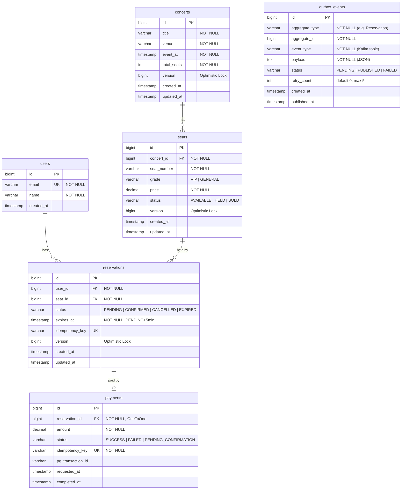

# ERD (Entity Relationship Diagram)

---

## 테이블 설명

### users
사용자 계정. 이메일은 unique.

### concerts
콘서트 이벤트. `version` 필드로 Optimistic Lock을 지원하나, 현재 주요 동시성 제어는 `seats` 테이블에서 이루어진다.

### seats
콘서트별 개별 좌석. `concert_id + status` 복합 인덱스(`idx_seat_concert_status`)로 잔여 좌석 조회를 최적화한다.
- `version`: 예약 생성 시 `seat.hold()` 호출에서 Optimistic Lock으로 동시 선점을 방어

### reservations
좌석 임시 선점 및 예약 상태 관리.
- `user_id` 인덱스(`idx_res_user`): 사용자별 예약 조회 최적화
- `status + expires_at` 복합 인덱스(`idx_res_status_expiry`): 만료 예약 스케줄러 쿼리 최적화
- `idempotency_key`: 예약 생성 중복 방지용 unique constraint

### payments
결제 정보. `reservation_id`는 OneToOne 관계로 unique.
- `idempotency_key`: 결제 중복 처리 방지용 unique constraint (Redis cold-start fallback)
- `pg_transaction_id`: PG사에서 발급하는 거래 ID

### outbox_events
Transactional Outbox 패턴의 이벤트 저장소. 다른 테이블과 FK 관계 없이 `aggregate_type + aggregate_id`로 느슨하게 연결된다.
- `event_type`이 Kafka 토픽 이름으로 사용됨 (`ReservationCreated`, `PaymentCompleted`, `ReservationExpired`)
- `status + created_at` 복합 인덱스(`idx_outbox_status_created`): 스케줄러의 PENDING 이벤트 FIFO 조회 최적화
- `retry_count >= 5` 이면 `FAILED`로 마킹되어 재시도 중단

---

## 인덱스 목록

| 테이블 | 인덱스 이름 | 컬럼 | 목적 |
|--------|------------|------|------|
| seats | idx_seat_concert_status | concert_id, status | 잔여 좌석 조회 |
| reservations | idx_res_user | user_id | 사용자 예약 조회 |
| reservations | idx_res_status_expiry | status, expires_at | 만료 스케줄러 |
| outbox_events | idx_outbox_status_created | status, created_at | 릴레이 스케줄러 FIFO |
