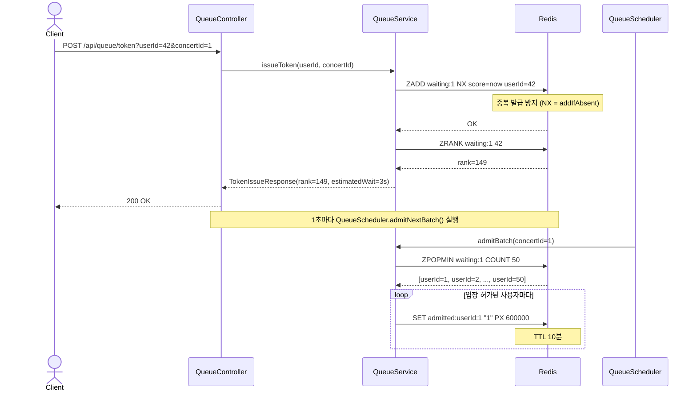
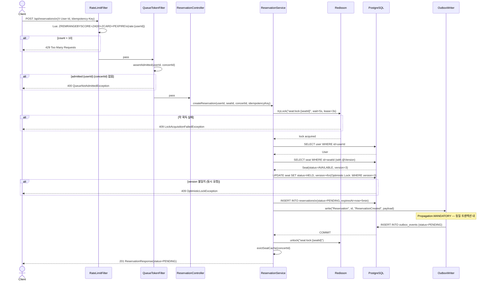
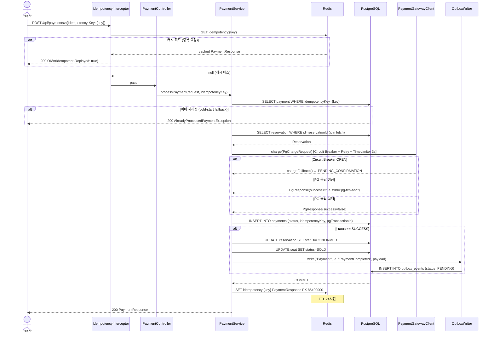
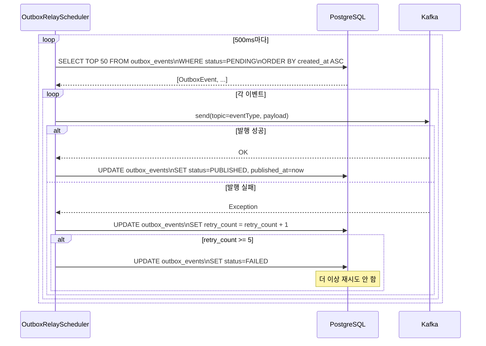
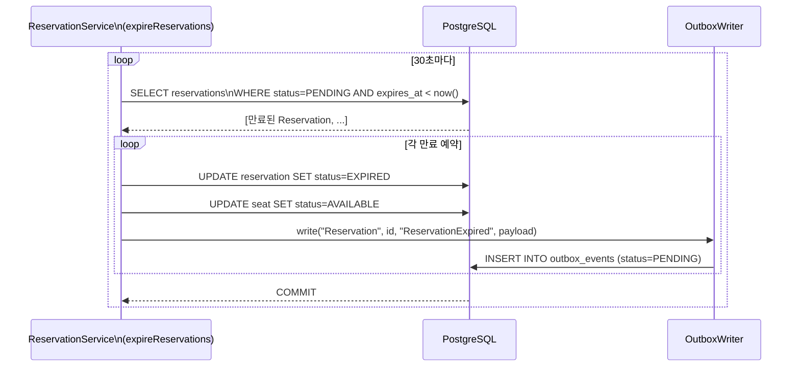

# 시퀀스 다이어그램

## 1. 대기열 토큰 발급 및 배치 입장

---

## 2. 좌석 예약 (Double-Lock + Outbox)

---

## 3. 결제 처리 (Idempotency + Circuit Breaker)

---

## 4. Outbox 릴레이 (Kafka 이벤트 발행)

---

## 5. 예약 만료 스케줄러 (30초 주기)

